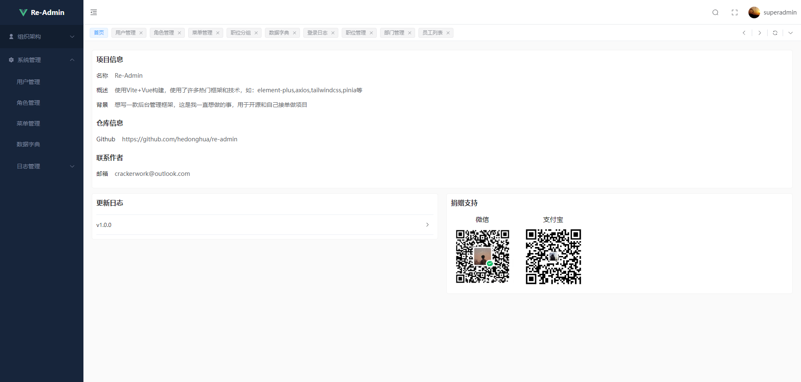
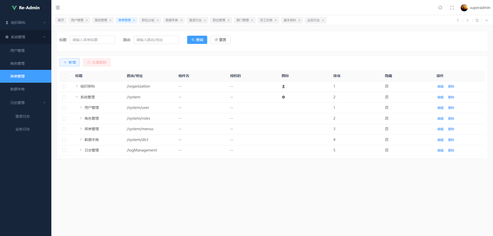
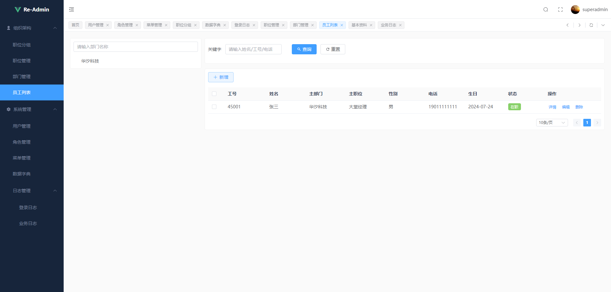
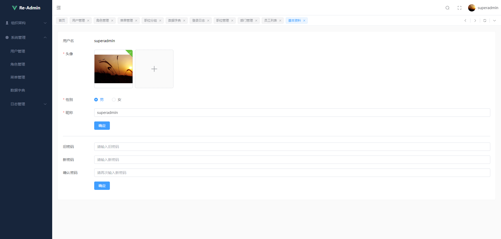
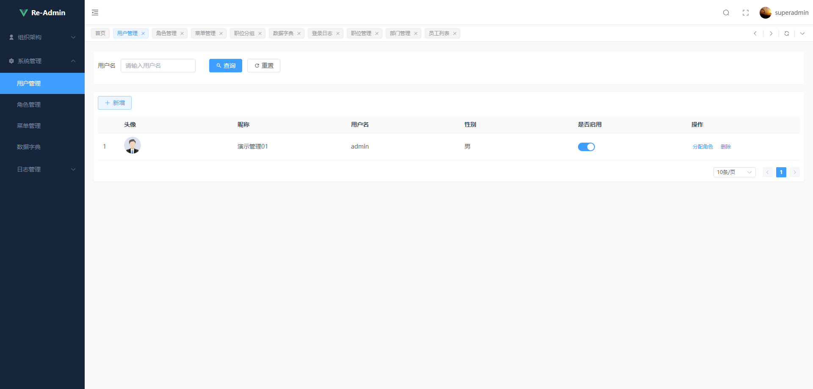

# re-admin-net

前端使用re-admin，后端使用abp框架。rbac（基于角色权限访问控制）通用权限管理，精确到按钮级别的权限控制。

<!-- PROJECT SHIELDS -->

[![Forks][forks-shield]][forks-url]
[![Stargazers][stars-shield]][stars-url]
[![Issues][issues-shield]][issues-url]
[![MIT License][license-shield]][license-url]

### 项目截图

### 开发环境

* .NET8+
* NodeJs18+

### 使用技术

* Abp
* .NETCore
* Dapper
* MediatR
* JWT
* Coravel
* Mapster
* Serilog
* Nito.AsyncEx
* IP2Region.Net
* MySQL
* EntityFrameworkCore
* Vue
* Pinia
* Lodash
* DayJs
* Axios
* ElementUI Plus
* TailwindCss

###### **使用步骤**

1. 数据库迁移

`dotnet migration database update`

2. 前端依赖下载

`yarn install`

### 作者

crackerwork@outlook.com

QQ: 1491184849

MySite: https://crackerwork.cn

### 版权说明

该项目签署了MIT 授权许可，详情请参阅 [LICENSE.txt][license-url]

<!-- links -->
[forks-shield]: https://img.shields.io/github/forks/1491184849/re-admin-net.svg?style=flat-square
[forks-url]: https://github.com/1491184849/re-admin-net/network/members
[stars-shield]: https://img.shields.io/github/stars/1491184849/re-admin-net.svg?style=flat-square
[stars-url]: https://github.com/1491184849/re-admin-net/stargazers
[issues-shield]: https://img.shields.io/github/issues/1491184849/re-admin-net.svg?style=flat-square
[issues-url]: https://img.shields.io/github/issues/1491184849/re-admin-net.svg
[license-shield]: https://img.shields.io/github/license/1491184849/re-admin-net.svg?style=flat-square
[license-url]: https://github.com/1491184849/re-admin-net/blob/master/LICENSE.txt

